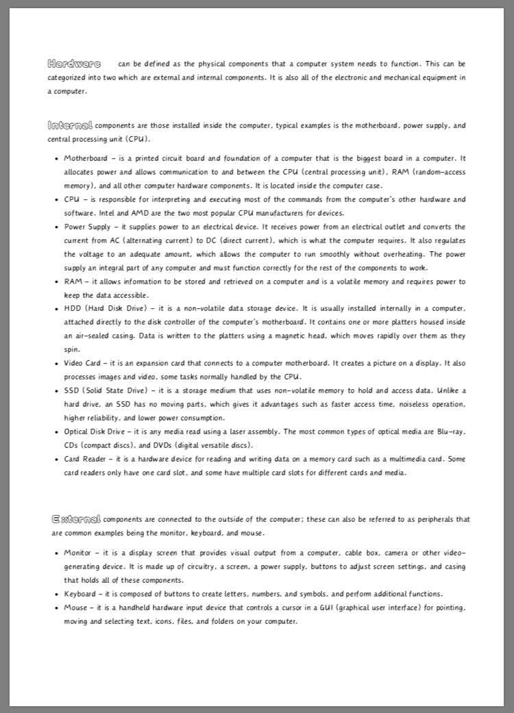
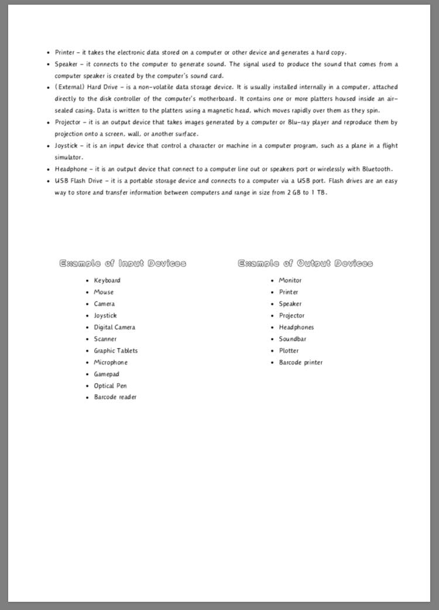
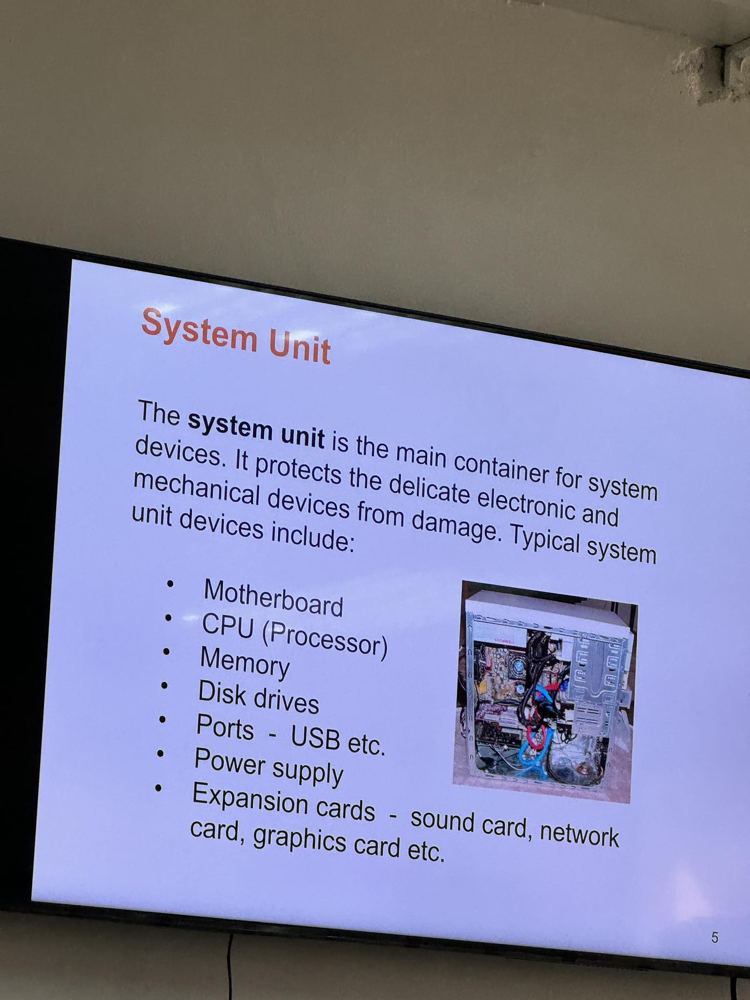

# 💫 CTHASOPL COM23P
## Course Overview
### Name: [Jay Arre Talosig](https://github.com/flexycode) 
### Subject: [CTHASOPL - Hardware, Software, and Peripheral Installation](https://www.youtube.com/watch?v=dQw4w9WgXcQ)
### Section: COM23P   
### Professor: Marizkays P. Jamison 👋
### No. of Units: [1.0 Units](https://www.youtube.com/watch?v=M5QY2_8704o)
### GPA : 1.50 [Passed](https://www.youtube.com/watch?v=19fUYjhGy0c)

# 📊 Table of Contents

## [Introduction](#introduction)
This repository contains notes and lecture for CTHASOPL that focuses on Hardware, Software, and Peripheral Installation.

# CTHASOPL - Hardware, Software, and Peripheral Installation

Welcome to the CTHASOPL course! In this course, we will be focusing on hardware, software, and peripheral installation. This documentation will provide you with all the necessary information to successfully complete the course.

# Course Objectives
By the end of this course, you will be able to:

* Understand the basics of hardware, software, and peripheral installation
* Identify different types of hardware components and their functions
* Install and configure software on various operating systems
* Connect and configure peripheral devices such as printers, scanners, and external storage devices
* Troubleshoot common installation issues and errors

# Course Contents
1. Introduction to Hardware Installation
* Understanding hardware components
* Tools required for hardware installation
* Step-by-step guide for hardware installation

2. Introduction to Software Installation
* Types of software installations
* Software installation methods
* Troubleshooting software installation issues

3. Peripheral Installation
* Types of peripheral devices
* Connecting and configuring peripherals
* Troubleshooting peripheral installation issues

4. Best Practices for Installation
* Safety precautions during installation
* Software and driver updates
* Regular maintenance and troubleshooting tips

# Prerequisites
* Basic knowledge of computer hardware and software
* Familiarity with operating systems (Windows, macOS, Linux)

# Resources

### Week 2

 

 


### Week 3
```bash
See in Week 3 Folder
```

### Week 4
```bash
See in Week 4 Folder
```
https://www.scribd.com/document/618925363/Notes-on-Acronyms

### Week 5
```bash
See in Week 5 Folder
```
* https://www.electronicshub.org/types-of-computer-ports/
* https://turbofuture.com/computers/the-motherboard-components

### Week 8  
* Assemble and Dissable of System Unit 
* Identify the ports in every socket in the motherboard
* Play along with the computer parts in order to familiarize those components each

### Week 9
* Install Operating System 
* Demonstrate how the Operating System works after installed
[Insert any additional resources or materials here]

# 💻 Assessment 
Grading will be based on [Insert assessment criteria here]
[Insert information about exams, assignments, and projects here]


# 🤝 Support
If you have any questions or need assistance during the course, please feel free to reach out to the instructor or the course support team.

# 👋 Contributors 
* [Anilov](https://github.com/tiquioani)
* [Gab](https://github.com/IYB-Mata)
* [Jay](https://github.com/flexycode) 

<!-- End point insert background effect line of sight color rainbow -->


<!-- Introduction Pannel button link, it will redirect to the top -->
#### [Back to Table of Content](#-table-of-contents)
<!-- End point line insert Thanks for visiting enjoy your day, feel free to modify this  -->
---
<p align="center">

</p>

<!-- Genshin Impact -->
<div align="center">

</div>

<!-- End point line insert Comeback again next time, feel free to modify this  -->
<p align="center">

</p>

</p>
    
<br>
<!-- End point insert background effect line of sight color red -->


